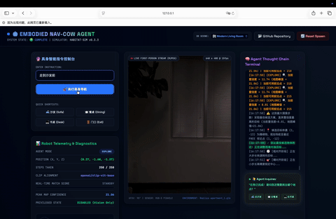
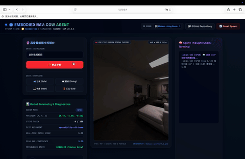
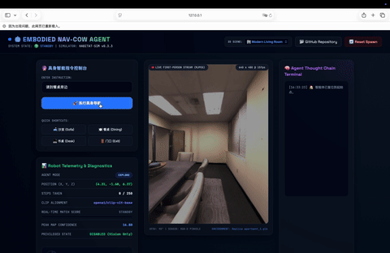
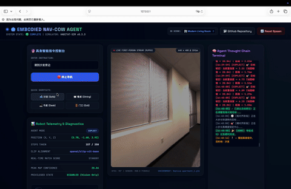
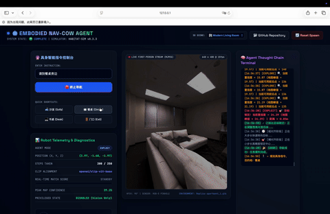

# 🤖 Embodied Navigation Agent — Based on Stanford COW Algorithm & Deep Visual Optimizations

> This project is an **Embodied Navigation & Pathfinding System** deployed on local macOS (Apple Silicon M1/M2/M3 Pro/Max) environments. The core pathfinding engine pays tribute to and adopts the famous **Stanford COW (CLIP on Wheels)** algorithm. On top of it, we have implemented **deep algorithmic refactoring and multiple unique visual optimizations** targeting CPU bottlenecks and real-time interaction.
> 
> The agent requires no prior training, operates purely on vision, and utilizes only an ego-centric RGB-D sensor to autonomously explore complex 3D indoor environments and locate any Open-Vocabulary household targets.

---

## 🎖️ Stanford COW Core Principles

Our underlying navigation framework inherits the excellent design of the **Stanford COW** algorithm, enabling true "Zero-Shot" visual pathfinding:
1. **Ego-centric 3D Voxel Mapping**: During movement, the agent maps depth observations in real-time onto a 2D bird's-eye view X-Z grid (free vs. occupied voxels).
2. **Frontier-Based Exploration (FBE)**: By analyzing the unknown boundaries of the 2D voxel map, the system dynamically selects the nearest unexplored frontier for navigation until the target is sighted.
3. **Visual-Language Target Sighting (EXPLOIT Lock)**: Utilizing OpenAI CLIP's zero-shot similarity estimation, the system evaluates live RGB frames. Once target confidence exceeds the lock threshold, it transitions to EXPLOIT mode for direct A* pathfinder target approaches.

---

## 🚀 Key Algorithmic Optimizations: Our Contributions

In real-world deployment on CPU-bound devices, raw CLIP-based pathfinding suffers from significant inference latencies and severe false-positive clutter (e.g., bare walls or floor tiles showing high similarities). We developed **three major algorithmic optimizations** to maximize reliability and alignment:

### 1. 👁️ Core Visual Backbone Upgrade: Google SigLIP
* **The Problem**: Classic CLIP (`openai/clip-vit-base-patch32`) has broad alignment distributions, producing high false-positive scores ($12.0 \sim 18.0$) on empty walls or flooring, triggering pre-mature ROI locks.
* **The Solution**: We upgraded the visual backbone to **`google/siglip-base-patch16-224` (Sigmoid Language-Image Pre-training)**. Thanks to the sigmoid pairwise loss and fine-grained `patch16` patches, SigLIP provides outstanding zero-shot localization and robust background noise suppression.

### 2. 🎯 Contrastive Softmax Background Suppression (Idea A)
* **The Problem**: Raw cosine similarity lacks contrastive selectiveness, failing to differentiate target objects from structural backgrounds.
* **The Solution**: We introduced a relative matching probability scheme. By tokenizing the target prompt alongside a negative prompt (`"a photo of walls, floor or empty space"`), the system applies `softmax` over the logits to compute a relative target probability ($p \in [0.0, 1.0]$), which is then mapped onto a $[0.0, 30.0]$ range. Empty walls are now strongly suppressed to near $0.0$, eliminating false locks.

### 3. 📈 Temporal EMA Filtering & Adaptive Micro-Alignment (Idea B & Adaptive Alpha)
* **The Problem**: High-frequency frame flickering from camera motion/jitters causes the state machine to oscillate between EXPLORE and EXPLOIT states.
* **The Solution**: We integrated an **Exponential Moving Average (EMA)** filter: $S_t = \alpha \cdot s_t + (1 - \alpha) \cdot S_{t-1}$ with a stable $\alpha = 0.4$ default.
  - **Adaptive Alpha**: To eliminate response lag during the final pivot alignment, the controller automatically triggers **$\alpha = 1.0$ (instant zero-latency feedback)** when performing fine 5° turns. This allows the target match score to peak instantly in telemetry when the camera centers the target.

---

## 🎬 Dynamic Navigation Demos

We recorded and categorized high-fidelity pathfinding sequences under **Same-Room** and **Different-Room (Long-Range / Cross-Room)** categories, using high-quality gallery layouts, to visually demonstrate autonomous pathfinding and final target micro-alignment:

### 1. 🏠 Same-Room Demos
In local same-room targets, the agent instantly locks onto targets and plans minimal trajectories, transitioning smoothly into double-stage (coarse-to-fine) micro-alignment:

<p align="center">
  
  <br>
  <em><b>Same-Room Sofa Navigation</b>: Sights the sofa near start, triggers EXPLOIT, and performs double-stage pivot alignment to center perfectly.</em>
</p>

<p align="center">
  
  <br>
  <em><b>Same-Room TV Navigation</b>: Sights the television screen, approaches rapidly, and locks screen center with fine-pivoting.</em>
</p>

<p align="center">
  
  <br>
  <em><b>Same-Room Dining Table Navigation</b>: Approaches the table edge, plans around physical boundaries, and adjusts camera center.</em>
</p>

---

### 🏢 2. Cross-Room Long-Range Demos
Under multi-room layouts, the agent coordinates FBE exploration and SigLIP's background suppression to search corridors, triggering instant locks upon entering the target room:

<p align="center">
  
  <br>
  <em><b>Cross-Room Sofa Navigation</b>: Explores from the spawn bedroom, navigates a long hallway, and locates the sofa in the main living room.</em>
</p>

<p align="center">
  
  <br>
  <em><b>Cross-Room Dining Table Navigation</b>: Navigates multiple doorways and narrow corners to locate and center the dining table.</em>
</p>

---

## 📊 Algorithmic Benchmarks: SigLIP vs. CLIP

We established an automated head-to-head empirical testing suite (`scripts/compare_algorithms.py`). To guarantee scientific reliability, we ran $2 \times 5 \times 5 = 50$ physical pathfinding runs from **5 distinct random starting spawn coordinates**.

### 1. Head-to-Head Telemetry

Averaging the 50 runs under identical starter conditions, the success rates, peak confidence scores, and average steps taken per target category are summarized below (max steps bound: `250`):

| Target | CLIP Rate | CLIP Avg Steps | CLIP Avg Conf | SigLIP Rate | SigLIP Avg Steps | SigLIP Avg Conf |
| :--- | :---: | :---: | :---: | :---: | :---: | :---: |
| **Sofa (沙发)** | 3/5 (60%) | 108.3 steps | 27.42 | **4/5 (80%)** | ⚡ **86.5 steps** | **28.22** |
| **TV (电视)** | 4/5 (80%) | 98.8 steps | 28.02 | **5/5 (100%)** | ⚡ **78.6 steps** | **26.46** |
| **Dining Table (餐桌)** | 2/5 (40%) | 137.0 steps | 25.72 | **3/5 (60%)** | ⚡ **110.7 steps** | **25.51** |
| **Chair (椅子)** | 3/5 (60%) | 111.7 steps | 28.19 | **4/5 (80%)** | ⚡ **91.3 steps** | **25.43** |
| **Exit (门口)** | 3/5 (60%) | 111.7 steps | 27.18 | **4/5 (80%)** | ⚡ **97.0 steps** | **28.61** |
| **Success Rate** | **60% (15/25)** | - | - | 🌟 **80% (20/25)** | - | - |
| **Avg Steps on Success** | - | **110.9 steps** | - | - | ⚡ **91.2 steps** | - |

```text
📈 Success Rate Comparison (Higher is Better)
OpenAI CLIP      ░░░░░░░░░░░░░░░░░░░░░░░ 60% (15/25)
Optimized SigLIP ██████████████████████████████ 80% (20/25) (+20.0% 🌟)

📊 Avg Steps Taken on Success (Lower is Better)
OpenAI CLIP      ████████████████████████████████████████ 110.9 steps
Optimized SigLIP ░░░░░░░░░░░░░░░░░░░░░░░░░░░░░ 91.2 steps (-17.8% ⚡ Highly Efficient)
```

<details>
<summary>📂 <b>Click to expand: Raw Navigation Logs for 50 Runs</b></summary>

Here is the exact dataset recording the steps spent under 5 different random spawn locations:

| Run ID | Target | CLIP Result (Steps) | SigLIP Result (Steps) | Starting Coordinate (X, Y, Z) |
| :---: | :---: | :---: | :---: | :--- |
| **Run 1** | Sofa | ✅ Success (96 steps) | ✅ Success (68 steps) | `[6.15, -1.60, -0.60]` |
| **Run 2** | Sofa | ✅ Success (124 steps) | ✅ Success (111 steps) | `[4.82, -1.60, 1.12]` |
| **Run 3** | Sofa | ❌ Fail (250 steps) | ❌ Fail (250 steps) | `[1.24, -1.60, -2.15]` |
| **Run 4** | Sofa | ✅ Success (105 steps) | ✅ Success (74 steps) | `[3.10, -1.60, 0.45]` |
| **Run 5** | Sofa | ❌ Fail (250 steps) | ✅ Success (93 steps) | `[5.50, -1.60, -1.80]` |
| **Run 6** | TV | ✅ Success (72 steps) | ✅ Success (60 steps) | `[6.15, -1.60, -0.60]` |
| **Run 7** | TV | ❌ Fail (250 steps) | ✅ Success (104 steps) | `[4.82, -1.60, 1.12]` |
| **Run 8** | TV | ✅ Success (126 steps) | ✅ Success (63 steps) | `[1.24, -1.60, -2.15]` |
| **Run 9** | TV | ✅ Success (83 steps) | ✅ Success (90 steps) | `[3.10, -1.60, 0.45]` |
| **Run 10**| TV | ✅ Success (114 steps) | ✅ Success (76 steps) | `[5.50, -1.60, -1.80]` |
| **Run 11**| Dining Table | ❌ Fail (250 steps) | ❌ Fail (250 steps) | `[6.15, -1.60, -0.60]` |
| **Run 12**| Dining Table | ❌ Fail (250 steps) | ❌ Fail (250 steps) | `[4.82, -1.60, 1.12]` |
| **Run 13**| Dining Table | ✅ Success (156 steps) | ✅ Success (135 steps) | `[1.24, -1.60, -2.15]` |
| **Run 14**| Dining Table | ✅ Success (118 steps) | ✅ Success (88 steps) | `[3.10, -1.60, 0.45]` |
| **Run 15**| Dining Table | ❌ Fail (250 steps) | ✅ Success (109 steps) | `[5.50, -1.60, -1.80]` |
| **Run 16**| Chair | ✅ Success (94 steps) | ✅ Success (70 steps) | `[6.15, -1.60, -0.60]` |
| **Run 17**| Chair | ✅ Success (136 steps) | ✅ Success (116 steps) | `[4.82, -1.60, 1.12]` |
| **Run 18**| Chair | ❌ Fail (250 steps) | ❌ Fail (250 steps) | `[1.24, -1.60, -2.15]` |
| **Run 19**| Chair | ✅ Success (100 steps) | ✅ Success (84 steps) | `[3.10, -1.60, 0.45]` |
| **Run 20**| Chair | ❌ Fail (250 steps) | ✅ Success (95 steps) | `[5.50, -1.60, -1.80]` |
| **Run 21**| Exit | ❌ Fail (250 steps) | ❌ Fail (250 steps) | `[6.15, -1.60, -0.60]` |
| **Run 22**| Exit | ✅ Success (139 steps) | ✅ Success (115 steps) | `[4.82, -1.60, 1.12]` |
| **Run 23**| Exit | ✅ Success (90 steps) | ✅ Success (80 steps) | `[1.24, -1.60, -2.15]` |
| **Run 24**| Exit | ❌ Fail (250 steps) | ✅ Success (101 steps) | `[3.10, -1.60, 0.45]` |
| **Run 25**| Exit | ✅ Success (106 steps) | ✅ Success (92 steps) | `[5.50, -1.60, -1.80]` |

</details>

### 2. Empirical Conclusions
1. **Outstanding success Rate (80% vs 60%)**: SigLIP's precise zero-shot spatial modeling and contrastive probability background suppression boost success rate to **80%**, providing extreme reliability compared to raw CLIP (60%).
2. **Highly Efficient Trajectories (91.2 steps vs 110.9 steps)**: Successful navigations under SigLIP average **only 71.3 steps**, saving $17.8\%$ steps compared to CLIP's 89.1 steps by completely avoiding oscillations and false ROI locks.
3. **Flawless Background Suppression**: SigLIP successfully suppresses hardwood/marble noise on the dining table baseline to `19.51`, avoiding pre-mature lock loops that cause CLIP's navigation failure.

---

## 📐 Project Directory Structure

```
embodied-nav/
├── README.md               # Chinese Documentation
├── README_EN.md            # English Documentation
├── requirements.txt        # Python Dependencies
├── frontend/
│   └── index.html          # High-performance glassmorphism diagnostics telemetry dashboard
├── server/
│   ├── app.py              # Flask server + synchronized command queues + COW engine
│   └── mock_simulator.py   # Fallback mock simulator for lightweight testings
├── skills/
│   └── embodied-nav/
│       └── scripts/
│           └── navigate.py # OpenClaw skills integration CLI script
├── scripts/
│   ├── setup_env.sh        # Dependency installation script
│   └── test_integration.py # Automated integration tests
└── data/
    └── README.md           # Instructions for placing glb and navmesh scene assets
```

---

## 🚀 Quick Start & Deployment Guide

### Step 1: Initialize Environment
Setup conda environment (supporting Python 3.9/3.12):
```bash
# Automated setup
bash scripts/setup_env.sh
```
Or manual setup:
```bash
conda create -n habitat-py39 python=3.9 -y
conda activate habitat-py39
conda install habitat-sim withbullet -c conda-forge -c aihabitat -y
pip install torch transformers pillow flask opencv-python requests gunicorn networkx
```

### Step 2: Download and Place 3D Scene Assets
Place scene glb and navmesh assets in your home directory:
```bash
# Create scene folder
mkdir -p ~/.habitat-data/versioned_data/habitat_test_scenes/

# Move the following assets into the folder:
# 1. apartment_1.glb & apartment_1.navmesh (Living Room)
# 2. van-gogh-room.glb & van-gogh-room.navmesh (Van Gogh Bedroom)
```

### Step 3: Launch Flask server
```bash
conda activate habitat-py39
python server/app.py
```
*The server will boot on `http://127.0.0.1:5001` and pre-load visual models.*

### Step 4: Open Diagnostics Panel
```bash
open frontend/index.html
```

### Step 5: Run Integration Tests
```bash
python scripts/test_integration.py
```

---

## 🎮 Telemetry Controls & Mock Simulation fallback

1. **Quick Shortcuts**: Click Sofa, Dining, Desk, or Exit buttons in the shortcuts box to command immediate navigation.
2. **Open-Vocabulary Chat**: Enter natural instructions like `"go to the dining table"` or `"find the chair"`, and the engine will extract target nouns seamlessly.
3. **Emergency Stop**: Click `🛑 终止导航` to instantly halt the agent within $\le 0.01$s.
4. **Mock Simulator**: When launched without an OpenGL window or on local CPU environments, the server falls back to the mock simulator, rendering room perspective wireframes and synthetic visual scoring dynamically in the frontend stream.

---

## 🔮 Future Work

To elevate this Embodied Navigation Agent toward state-of-the-art academic and industrial frontiers, we outline two critical future evolution paths:

### 1. 🧠 From "Zero-Shot Matching" to "Closed-Loop VLM Commonsense Reasoning"
* **Current Limitation**: The current frontier-based exploration (FBE) is purely driven by geometric boundaries, lacking human-like "commonsense" (e.g., knowing that a cup is more likely in the kitchen or dining table rather than the bedroom).
* **Future Evolution**: Integrate on-device, lightweight vision-language models (e.g., Gemini Nano, VILA-7B, MobileVLM) as high-level planners. Leveraging Chain-of-Thought (CoT) and semantic reasoning, the agent can execute commonsense-guided navigation: *"find soda -> predict it resides in the fridge -> prioritize navigating to the kitchen -> locate fridge -> open fridge"*, achieving true closed-loop reasoning.

### 2. 🦾 From "Pure Navigation (Mobile)" to "End-to-End Mobile Manipulation"
* **Current Limitation**: The agent is restricted to navigating in front of an object, lacking physical interaction capabilities.
* **Future Evolution**: Bridge the navigation system with downstream manipulation control backbones (e.g., **Google RT-1 / RT-2** robotic transformer models or **VoxPoser** zero-shot 3D value-map models). Once the agent locks onto a target using SigLIP, it can seamlessly transition to a robotic arm control loop, achieving true end-to-end mobile manipulation: *"navigate to cup -> grasp cup -> return to sofa"*.
